## 计算机毕业设计YOLO+AI多模态大模型智慧交通事故检测分析系统 深度学习 人工智能 大数据毕业设计(源码+LW+PPT+讲解)

## 要求
### 源码有偿！一套(论文 PPT 源码+sql脚本+教程)

### 
### 加好友前帮忙start一下，并备注github有偿交通检测26
### 我的QQ号是2827724252或者微信:bysj2023nb

# 

### 加qq好友说明（被部分 网友整得心力交瘁）：
    1.加好友务必按照格式备注
    2.避免浪费各自的时间！
    3.当“客服”不容易，repo 主是体面人，不爆粗，性格好，文明人。
## 技术
前端技术栈 (web-vue)
核心框架: Vue 3.5.13 (Composition API)
UI组件库: Element Plus 2.9.4
状态管理: Pinia 2.3.1
路由管理: Vue Router 4.5.0
HTTP客户端: Axios 1.7.9
图表可视化: ECharts 5.6.0
构建工具: Vite 6.1.0 + TypeScript 5.7.2

后端+算法端技术栈 (web-flask)
核心框架: Flask (Python)
数据库: SQLite 3
身份认证: JWT
图像处理: OpenCV + NumPy
深度学习: YOLOv8/YOLO11/YOLO12/YOLO26
视频处理: OpenCV视频流处理
大语言模型: Qwen-VL的API接口

## 功能模块
核心创新点
1. 交通事故场景精准检测: 支持道路交通事故及相关车辆目标的智能识别和定位
2. 多模态检测方式: 支持图片、视频、实时摄像头三种检测模式
3. YOLO模型集成: 集成YOLOv8/YOLO11/YOLO12/YOLO26等先进目标检测模型
4. 智能检测分析: 基于AI的交通事故及相关车辆目标自动识别和定位
5. 分层权限管理: 支持管理员和普通用户的差异化功能访问
6. 完整工作流程: 从数据集管理到模型管理再到交通事故检测的完整闭环
7. 多模态大模型辅助分析: 使用多模态大模型根据YOLO检测识别结果和图片进一步分析并给出合理治理建议(属于图片识别功能模块)
8. 模型评估系统: 支持上传YOLO格式标签与模型预测对比，自动计算Precision、Recall、mAP50等精度指标，生成GT框与预测框的可视化对比图，支持用户评分和评语

核心功能模块
1. 用户管理: 支持用户注册、登录、权限管理、个人信息管理等功能
2. 数据集管理: 支持上传ZIP格式YOLO数据集，自动验证数据集结构和完整性
3. 模型管理: 支持创建模型、上传权重、训练过程图片/文件管理、模型发布等
4. 图片检测: 上传交通场景图片进行事故与车辆检测，支持 CLAHE 图像增强、多模态 AI 事故场景分析、安全治理建议生成、导出 Word 报告
5. 视频检测: 上传视频进行逐帧检测，支持帧率采样、异步处理、进度查询、关键帧截图
6. 实时检测: 使用电脑摄像头进行实时检测，支持yolo目标跟踪、会话管理、检测记录保存
7. 模型评估: 上传图片和标签文件评估模型性能，支持精度指标计算、可视化对比、用户评分筛选
应用场景
- 城市道路监控: 城市道路、路口、隧道等场景下的交通事故自动识别与记录
- 高速公路管理: 高速公路及匝道上的追尾、侧撞、连环事故检测与事后检索
- 智慧交管: 协助交管平台快速筛查海量视频中的事故片段、结构化事故信息
- 教育培训: 交通安全教学、事故案例分析等场景下的智能可视化演示

## 演示视频如下：

https://www.bilibili.com/video/BV1sVLx6WEgH/

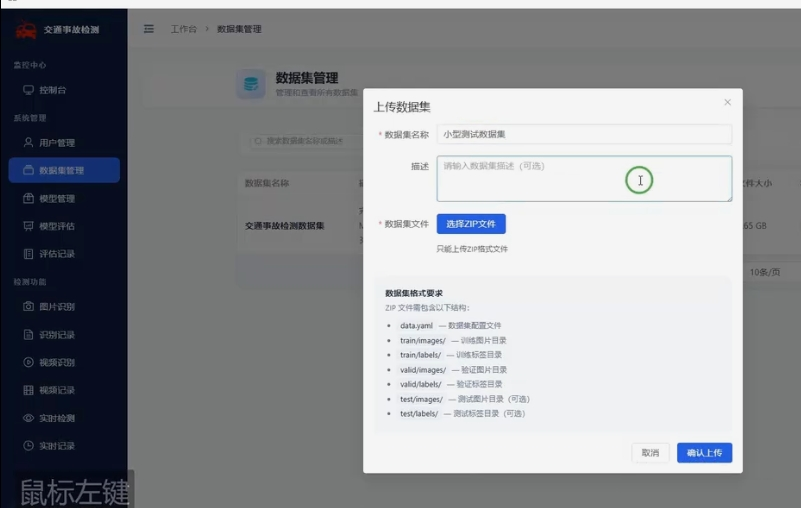
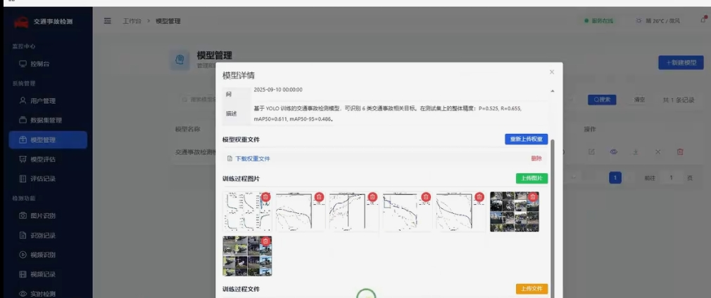
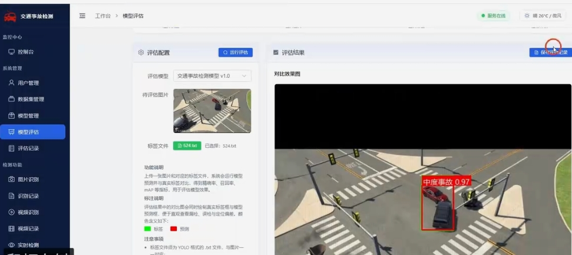
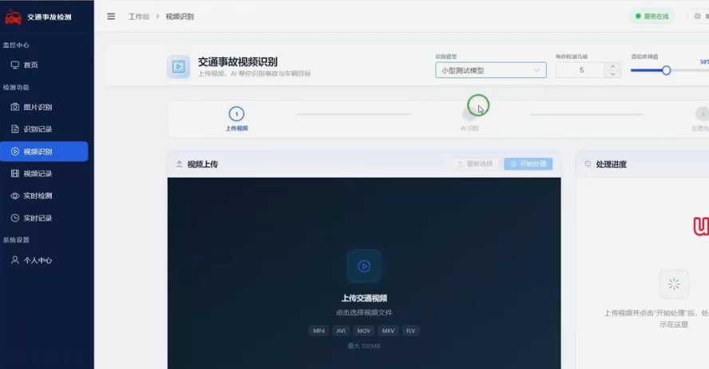
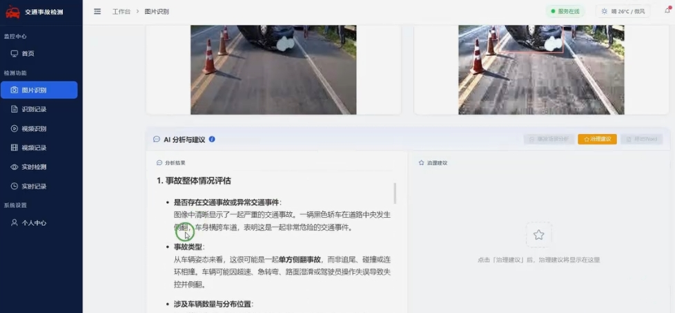
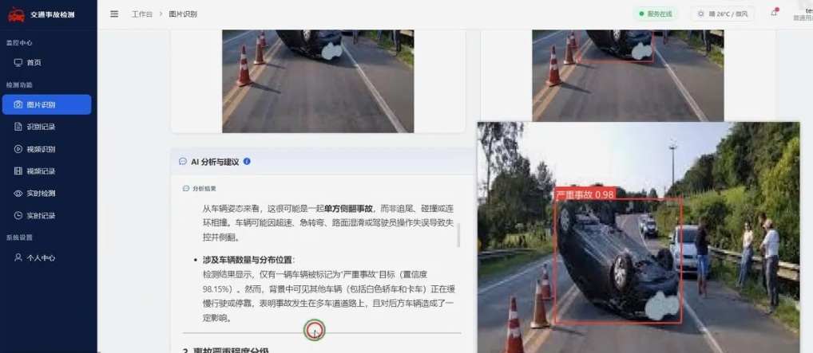
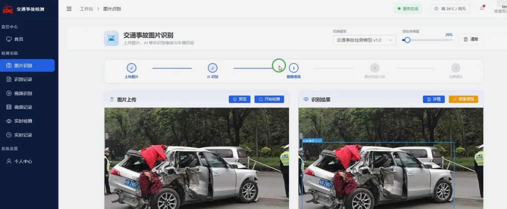
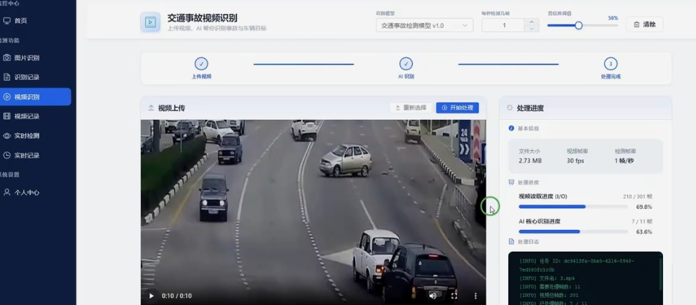
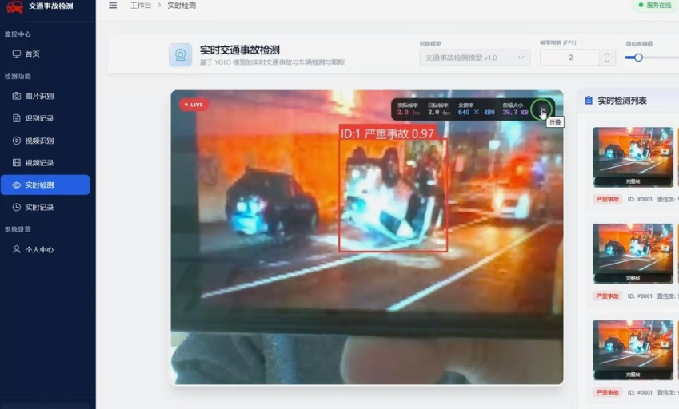
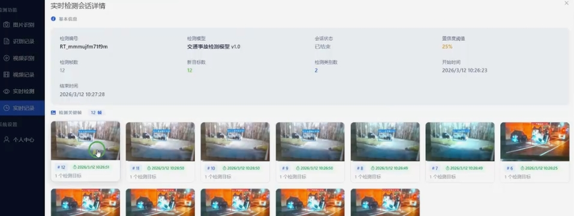
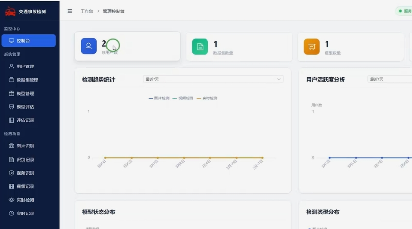
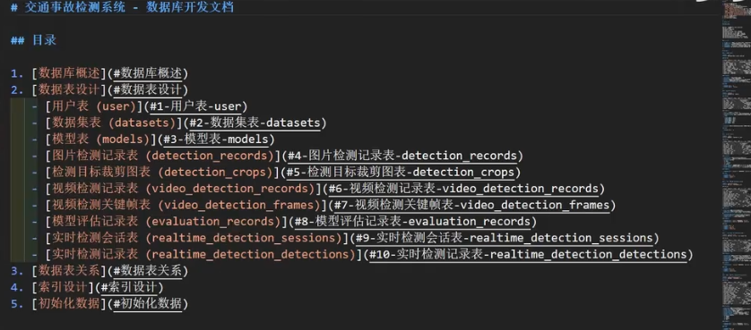
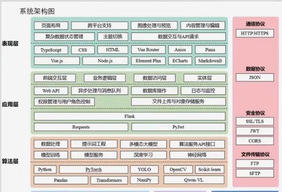
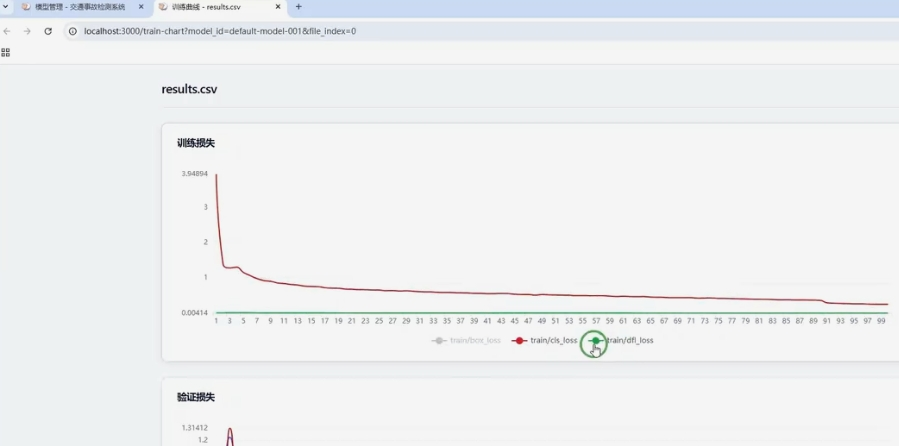
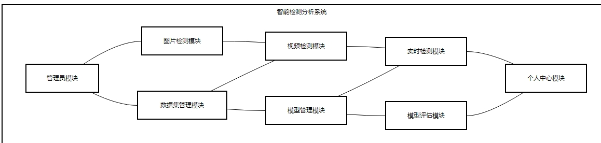
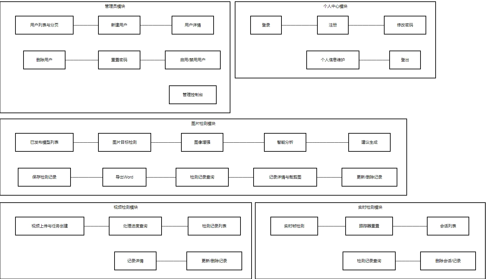
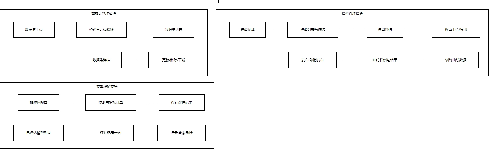
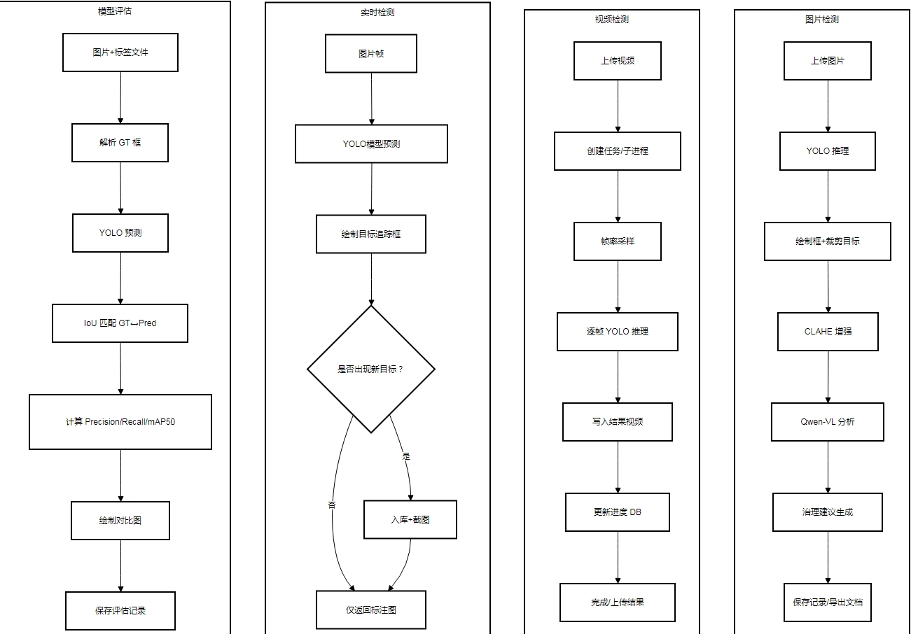

## 演示视频

https://www.bilibili.com/video/BV1sVLx6WEgH/

